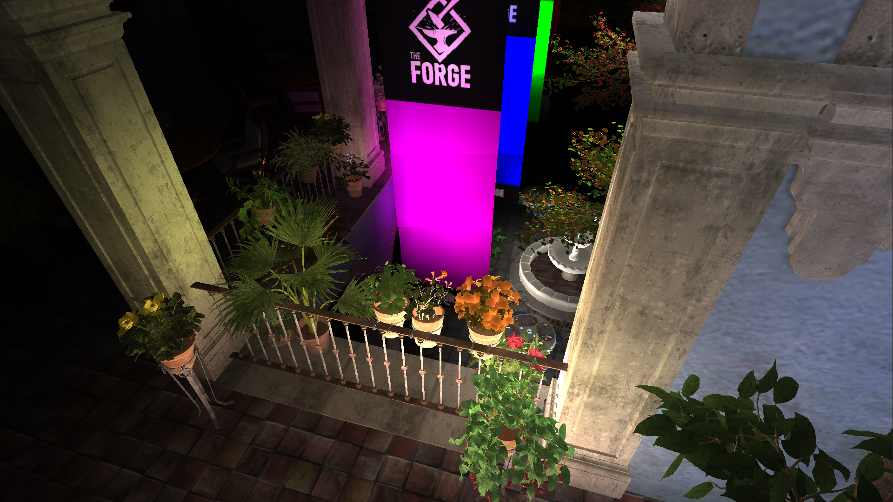
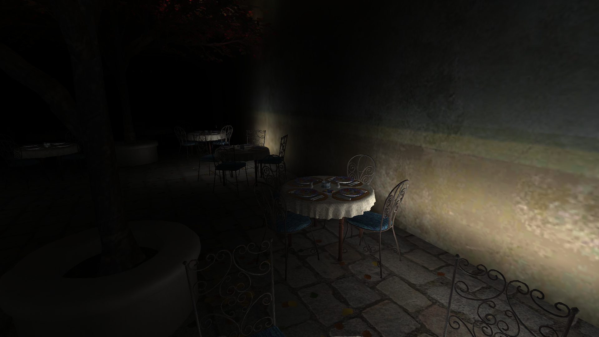
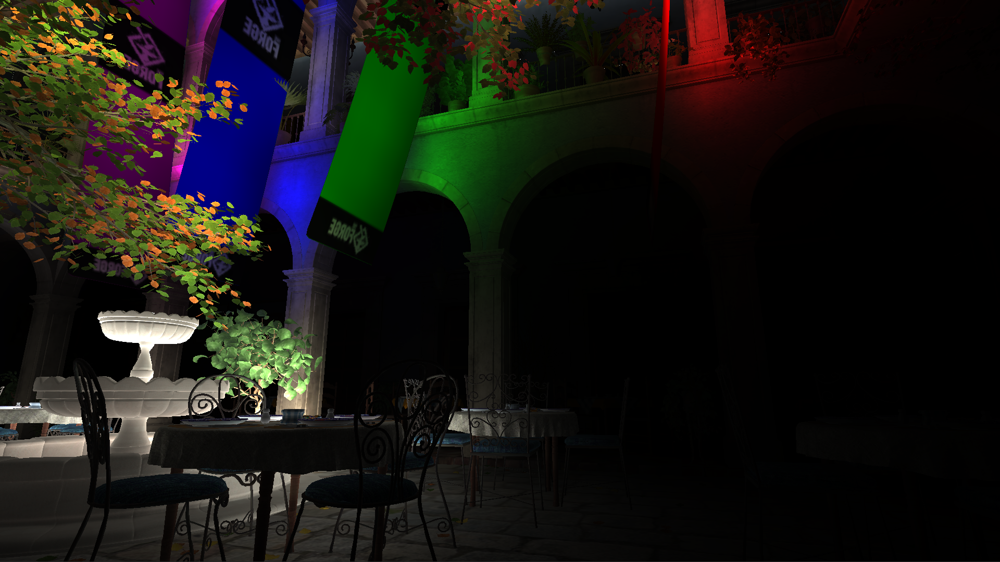
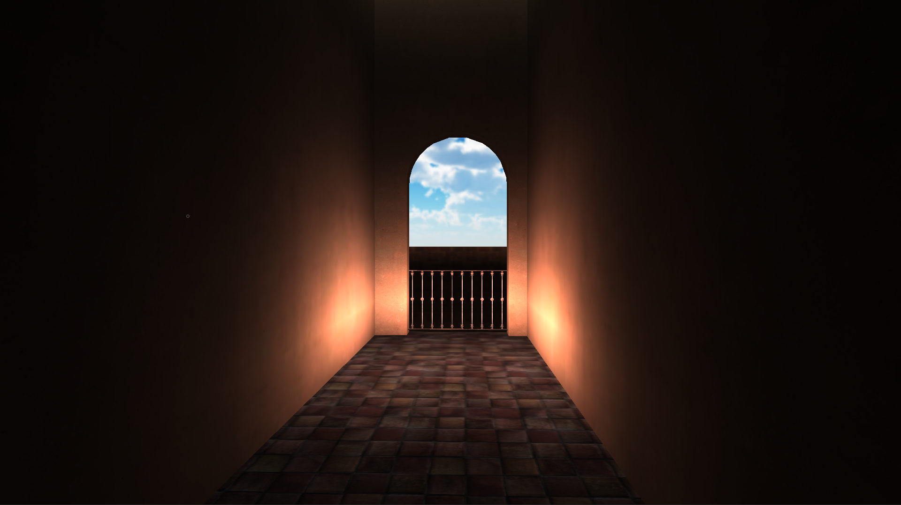
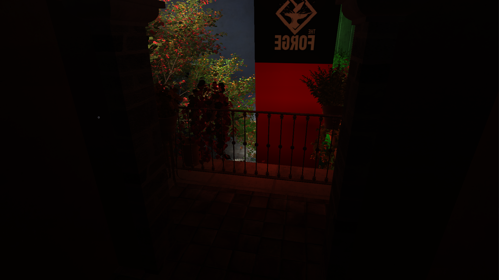
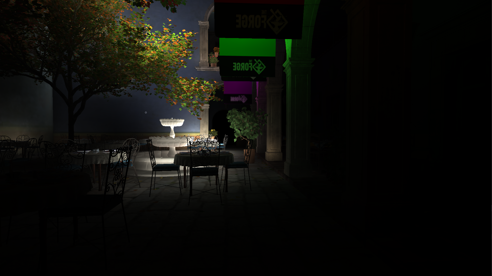

# Aura 3
----

[](https://vimeo.com/88113804)
[](https://vimeo.com/88114035)

Aura 3 is a middleware solution for implementing global illumination. It runs on top of [The Forge](https://github.com/ConfettiFX/The-Forge) and currently supports the following platforms
* Windows 10
* macOS
* Linux
* XBOX One
* PS4

Check out the demo videos by clicking the images above!

## Main Features

  - Specular GI
  - Diffuse GI
  - GPU Propagation

| Looking Down |
|---|
||

| Tables |
|---|
||

| Looking Up |
|---|
||

| Hallway |
|---|
||

| Balcony |
|---|
||

| Looking Across |
|---|
||


# News
All the releases happen in sync with [The Forge](https://github.com/ConfettiFX/The-Forge) and have therefore the same release number.

 
## Installation

 To build Aura you would need to need to download the latest version of [The Forge](https://github.com/ConfettiFX/The-Forge). Your folder overview should look like this:

 ```
 The-Forge
 Custom-Middleware
 ```


## Customization

We can customize Aura to fit your game engine (UE4, Unity, and even any custom engine)!

Below is the list of our customers

- [Deep Silver Volition](https://www.dsvolition.com/)


## License

[Creative Commons Attribution-NonCommercial 4.0 International License](https://creativecommons.org/licenses/by-nc/4.0/legalcode)


## Contact Us

E-mail: info@conffx.com
