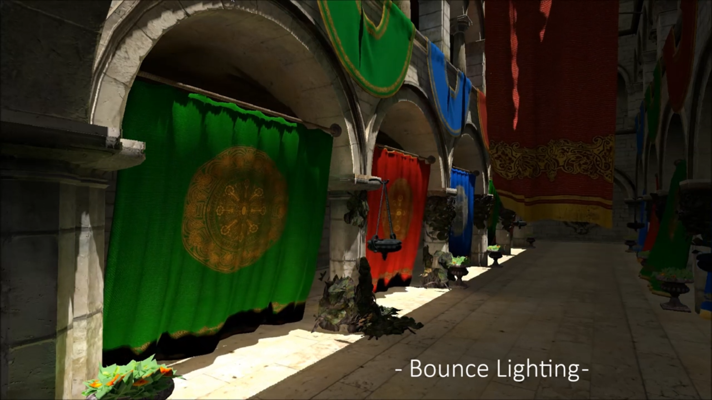
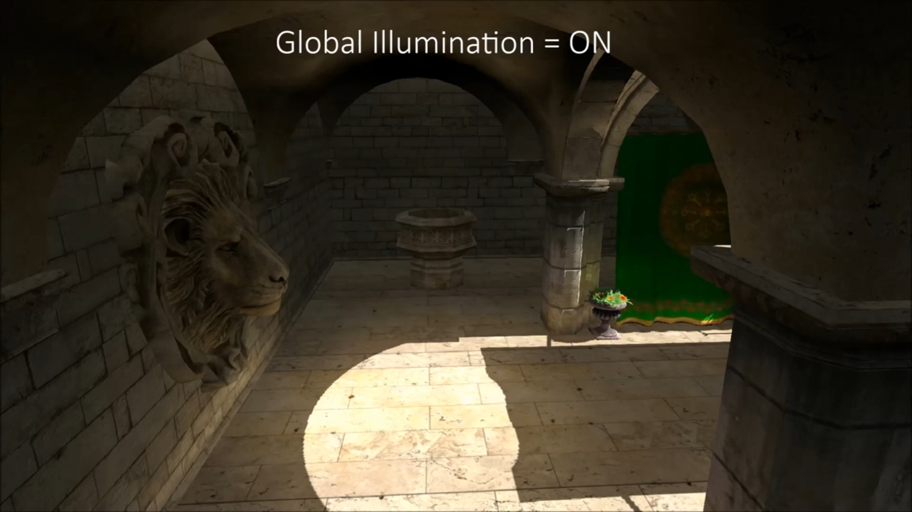
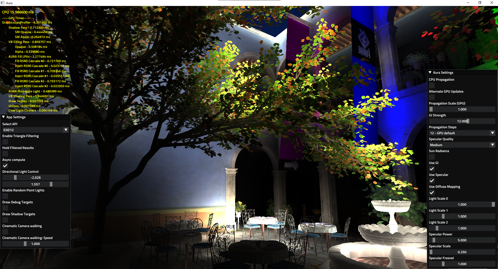
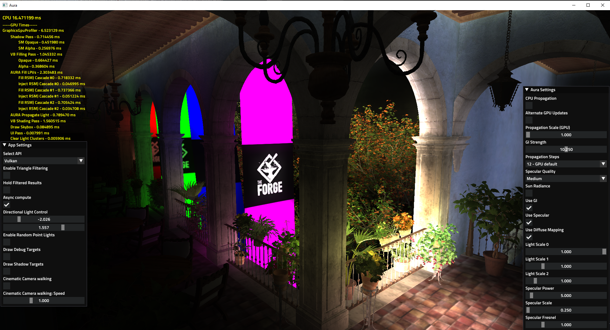
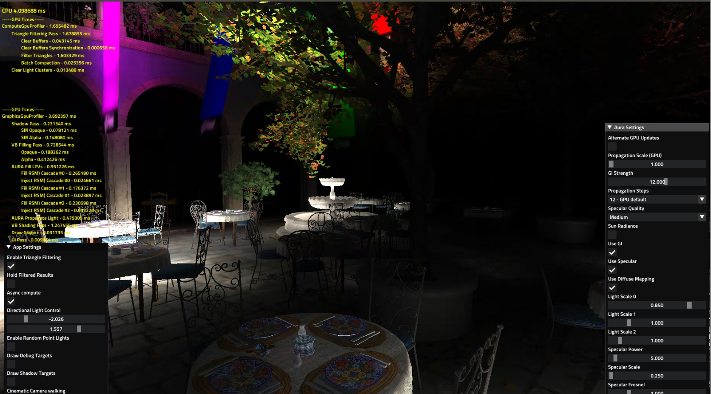
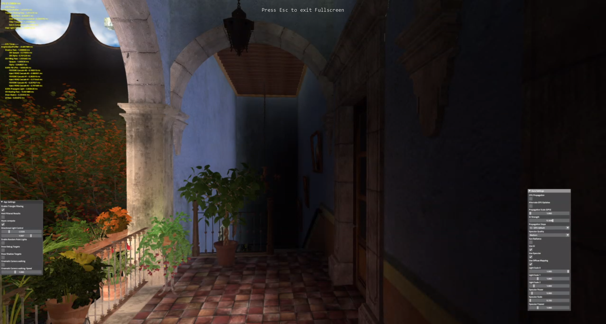

# Aura 3
----

[](https://vimeo.com/88113804)
[](https://vimeo.com/88114035)

Aura 3 is a middleware solution for implementing global illumination. It runs on top of [The Forge](https://github.com/ConfettiFX/The-Forge) and currently supports the following platforms
* Windows 10
* macOS
* Linux
* XBOX One
* PS4

Check out the demo videos by clicking the images above!

## Main Features

  - Specular GI
  - Diffuse GI
  - CPU and GPU Propagation

We developed this system in the 2010 / 2011 time frame. It is hard to believe it is 10 years ago now :-) ... it shipped in Agents of Mayhem at some point and was implemented and used in other games. We are just putting the "base" version without any game specific modifications in our commercial Middleware repository on GitHub. The games that used this system made specific modifications to the code base to align with their art asset and art style.
 In today's standards this system still fulfills the requirement of a stable rasterizer based Global Illumination system. It runs efficiently on the original XBOX One, that was the original target platform, but might require art asset modifications in a game level. 
 It works with an unlimited number of light sources with minimal memory footprint. You can also cache the reflective shadow maps for directional, point and spotlights the same way you currently cache shadow maps. At some point we did a demo running on a second generation integrated Intel GPU with 256 lights that emitted direct and indirect light and had shadow maps in 2011 at GDC? :-)
 It is best to integrate that system in a custom game engine that can cache shadow maps in an intelligent way. 

Aura - Windows DirectX 12 Geforce 980TI 1080p Driver 466.47




Aura - Windows Vulkan Geforce 980TI 1080p Driver 466.47



Aura - Ubuntu Vulkan Geforce RTX 2080 1080p



Aura - PS4



Aura - XBOX One original


# News
All the releases happen in sync with [The Forge](https://github.com/ConfettiFX/The-Forge) and have therefore the same release number.

 
## Installation

 To build Aura you would need to need to download the latest version of [The Forge](https://github.com/ConfettiFX/The-Forge). Your folder overview should look like this:

 ```
 The-Forge
 Custom-Middleware
 ```


## Customization

We can customize Aura to fit your game engine (UE4, Unity, and even any custom engine)!

Below is the list of our customers

- [Deep Silver Volition](https://www.dsvolition.com/)


## License

[Creative Commons Attribution-NonCommercial 4.0 International License](https://creativecommons.org/licenses/by-nc/4.0/legalcode)


## Contact Us

E-mail: info@conffx.com
