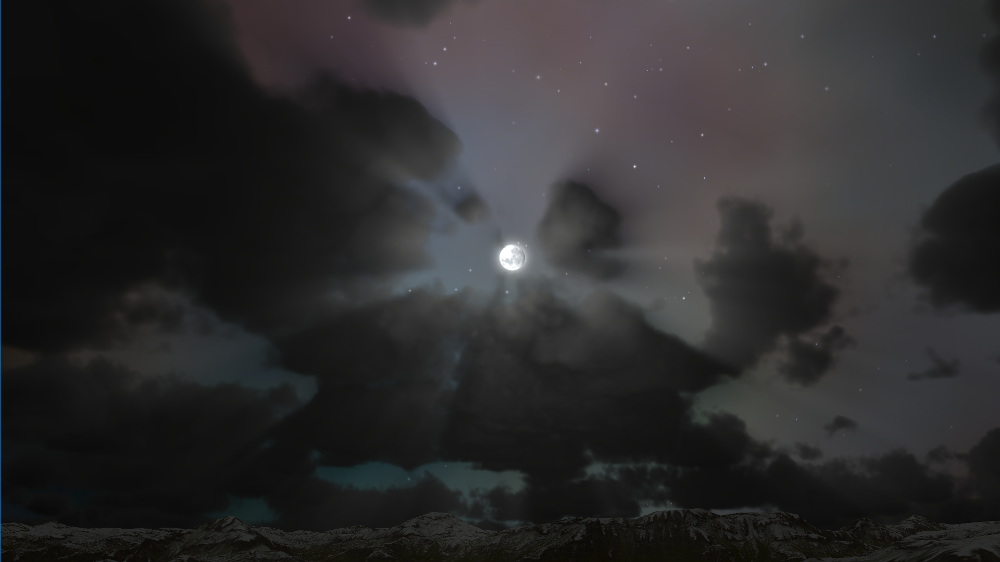
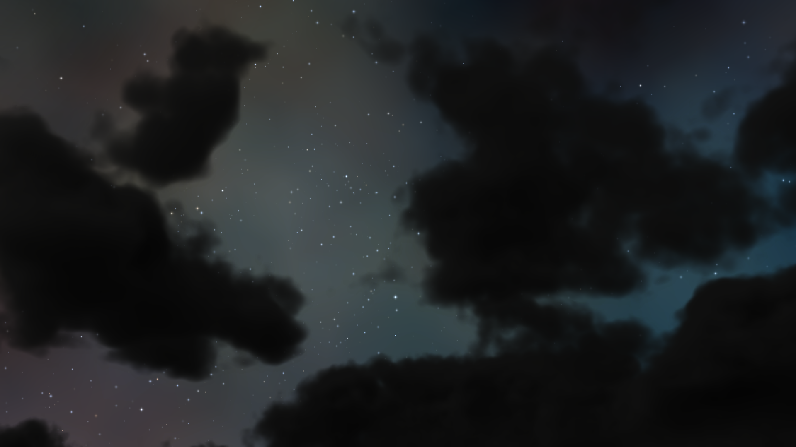
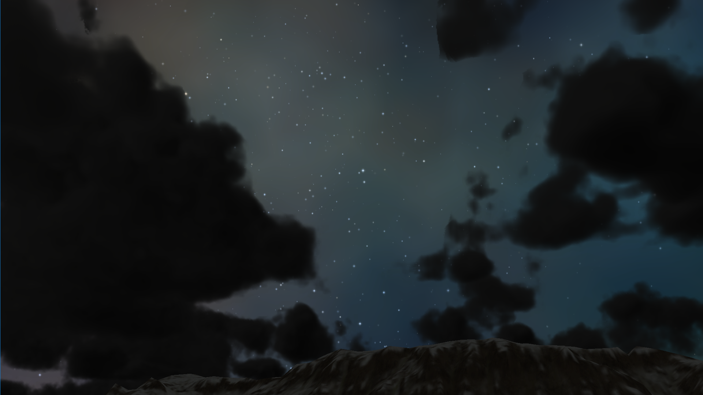
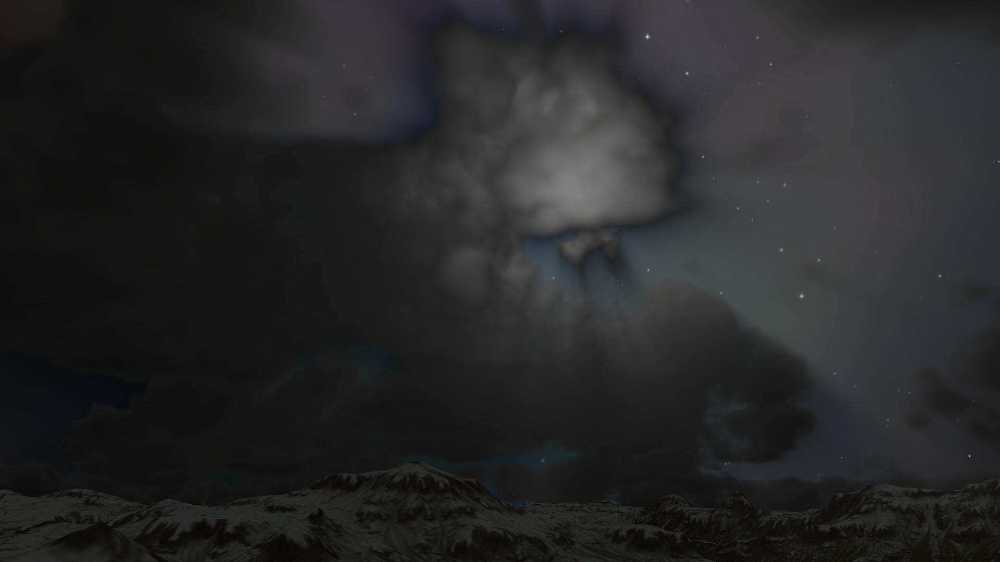
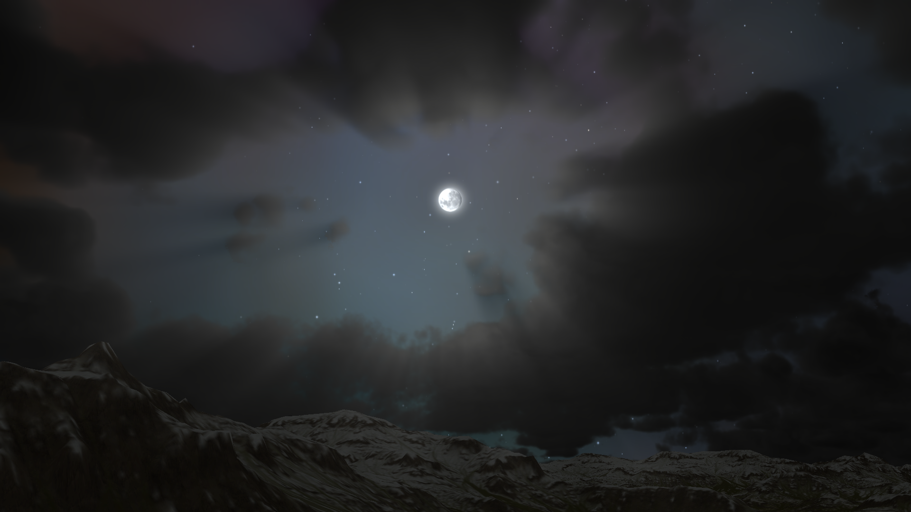
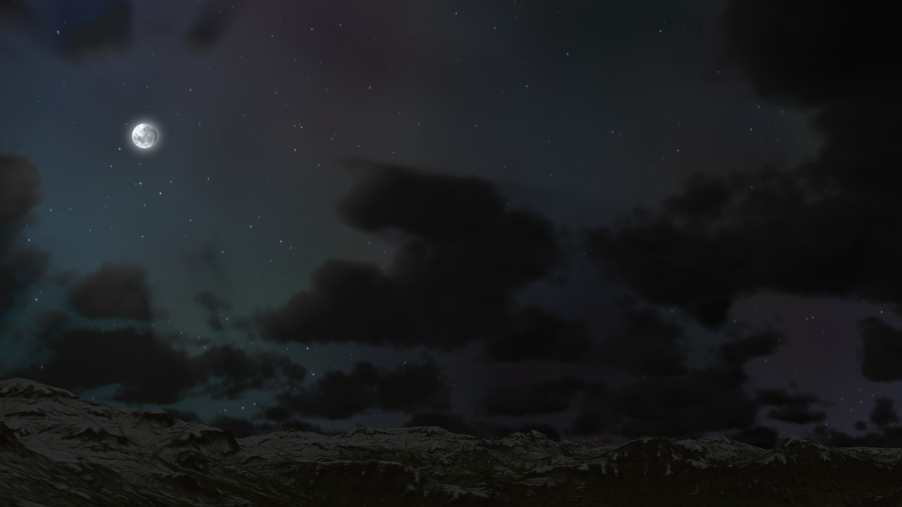

# Ephemeris
----

| Day Scene (Click on Image to view a Video) | 
|---|
[](https://vimeo.com/369379476)

| Night Scene (Click on Image to view a Video) |
|---|
[](https://vimeo.com/352541826)

Ephemeris 2 is a middleware solution for implementing a dynamic 24 hour Skydome System. It is running on top of [The Forge](https://github.com/ConfettiFX/The-Forge) and therefore supports the same platforms. We will release Ephemeris 1 for the iOS / Android mobile platforms in the future.

Check out the demo video by clicking the main image above!

## Main Features

  - Dynamic 24 hour time cycle (sunrises, sunsets, blue sky, sun and moon)
  - Atmospheric Scattering
  - Volumetric Clouds
  - Godrays
  - Procedural Night Sky and Star-field 
  - Simulation of astronomically correct sun, stars and moon (coming soon)
  - 2.5D Clouds for mobile (coming soon with Ephemeris 1)
   
| Day Scene |
|---|
||

| Twilight Scene |
|---|
||

| Night Scene |
|---|
||

| Cloudy Scene |
|---|
||

| Space Scene |
|---|
||


# News
All releases happen in sync with [The Forge](https://github.com/ConfettiFX/The-Forge) and have therefore the same release number.


## Release 1.38 - November 14th - Cross-Platform Path Tracer
Maintenance release following the update of The Forge. 

## Release 1.37 - October 28th, 2019
* New features
  * Add Earth radius: controls the radius of clouds' radius with scale factor. The clouds field will be flatter and the user can see further along the horizon if the radius increase
  * Add noise flow: controls the direction and intensity of clouds' noise flow
  * Add rotation: rotates clouds based on a certain pivot position.
  * Add the second layer: it is possible to generate the second cloud layer which can act, independently
  * Add FXAA

* Improvement
  * Ray-marching: now, hard-edge artifact is significantly reduced
  * Silver-lining: improved its quality
  * God ray: improved its quality
  * Performance: up to 25% performance increased

## Release 1.36 - October 18th, 2019
Maintenance release following the upate of the Forge.

## Release 1.35 - October 3rd, 2019
Maintenance release following the upate of the Forge.

## Release 1.34 - September 23rd
Maintenance release following the upate of the Forge.

## Release 1.33 - August 30th
Maintenance release following the upate of the Forge.

## Release 1.36 - October 18th, 2019
Maintenance release following the upate of the Forge.

## Release 1.35 - October 3rd, 2019
Maintenance release following the upate of the Forge.

## Release 1.34 - September 23rd
Maintenance release following the upate of the Forge.

## Release 1.33 - August 30th
Maintenance release following the upate of the Forge.

## Release 1.32 - August 9th - Ephemeris Night Sky update 
* Add Procedural Night Sky and Star-field - the night sky's nebula colors are now customizable
* Add Glow effects on Sun and Moon
* Fix the issue that Godrays can be drawn on unexpected area

Click on the following screenshot to see a movie:

 [](https://vimeo.com/352541826)

 More night scene screenshots:












 
## Installation

 To build Ephemeris you would need to download the latest version of [The Forge](https://github.com/ConfettiFX/The-Forge). Your folder overview should look like this:

 ```
 The-Forge
 Custom-Middleware
 ```

The release version of Ephemeris and the release version of The Forge need to be the same.


## Customization

We can customize Ephemeris to fit your game engine (UE4, Unity, and even any custom engine)!

Below is the list of our customers

- [Insomniac Games](https://insomniac.games/)


## License

[Creative Commons Attribution-NonCommercial 4.0 International License](https://creativecommons.org/licenses/by-nc/4.0/legalcode)


## Contact Us

E-mail: info@conffx.com
