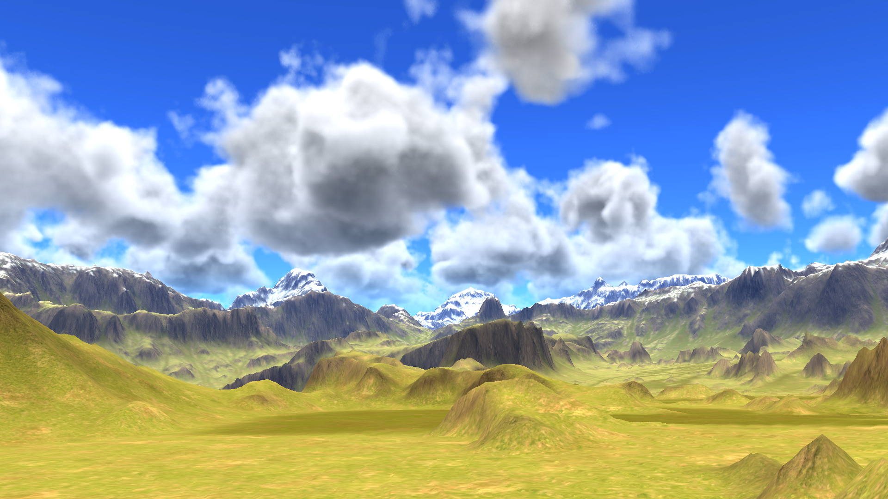

# Custom Middleware

This repository holds the publicly released middleware packages of The Forge Interactive Inc. a [Khronos member](https://www.khronos.org/members/list)

## Main Features

# Aura 3

Aura 3 is a middleware solution for implementing global illumination. Read more here ./Aura/README.md

# Ephemeris 2

Ephemeris 2 is a middleware solution for implementing a dynamic 24 hour Skydome System. Read more here ./Ephemeris/README.md

