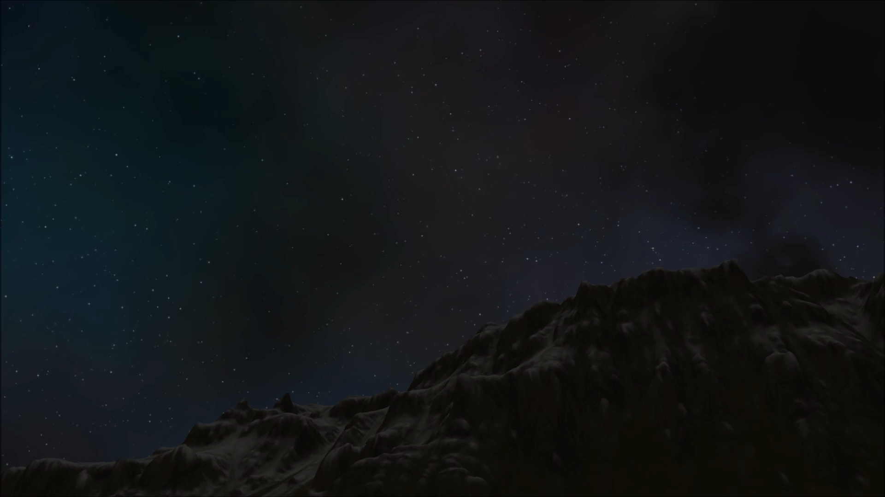

# Ephemeris 2
----

[](https://vimeo.com/344675521)

Ephemeris2 is our new middleware solution for implementing a dynamic skydome system.

Ephemeris2 supports various platforms and can be customized and intergrated into any custom engine.

You can also check the demo video by clicking the main image above!


### Main Features
  - Dynamic 24 hour time cycle (sunrises, sunsets, blue sky, sun and moon)
  - Atmospheric Scattering
  - Volumetric Clouds
  - God rays
  - 2.5D Clouds for mobile (Coming Soon!)
  - Simulation of astronomically correct sun, stars and moon (Coming Soon!)
   
| Dawn Scene |
|---|
||

| Day Scene |
|---|
||

| Twilight Scene |
|---|
||

| Night Scene |
|---|
||

| Cloudy Scene |
|---|
||

| Above the Clouds |
|---|
||


### Platforms
  - Windows
  - macOS
  - Linux
  - XboxOne
  - iOS (Coming Soon!)
  - Android (Coming Soon!)


### Installation

 * For PC Windows run PRE_BUILD.bat. It will download and unzip the art assets and install the shader builder extension for Visual Studio 2017.
 * For Linux and Mac run PRE_BUILD.command. If its the first time checking out the forge make sure the PRE_BUILD.command has the correct executable flag by running the following command
 ```sh
  chmod +x PRE_BUILD.command
 ```


### Customization

We can customize Ephemeris2 to fit your game engine (UE4, Unity, and even any custom engine)!

Below is the list of our customers

- [Insomniac Games](https://insomniac.games/)


### License

[Creative Commons Attribution-NonCommercial 4.0 International License](https://creativecommons.org/licenses/by-nc/4.0/legalcode)


### Contact Us

E-mail: info@conffx.com
