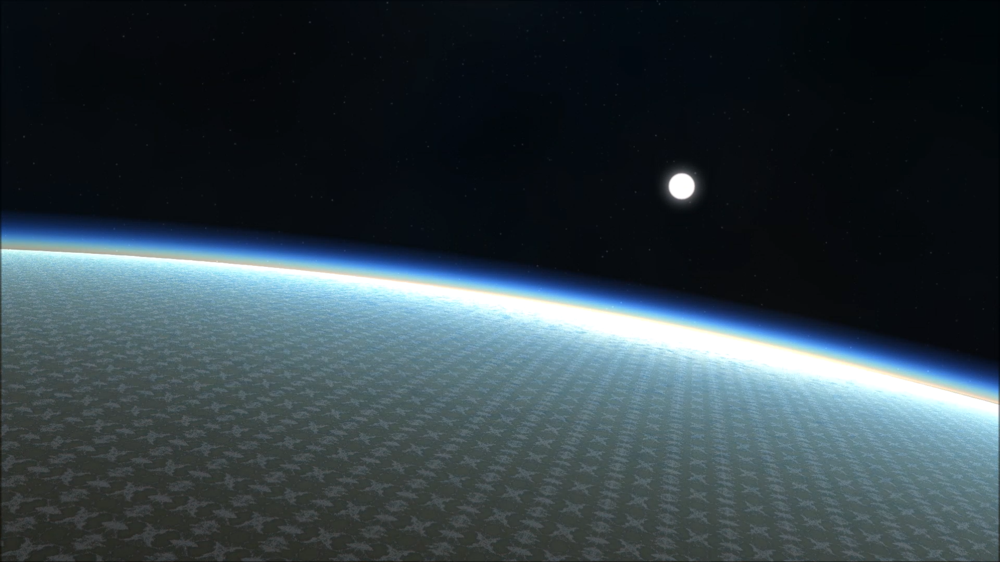

# Ephemeris 2
----

[](https://vimeo.com/344675521)

Ephemeris 2 is a middleware solution for implementing a dynamic 24 hour Skydome System. It is running on top of [The Forge](https://github.com/ConfettiFX/The-Forge) and therefore supports the same platforms, which are at the moment 
* Windows 10
* macOS
* Linux
* XBOX One
* PS4
* iOS
* Android

Check out the demo video by clicking the main image above!

## Main Features

  - Dynamic 24 hour time cycle (sunrises, sunsets, blue sky, sun and moon)
  - Atmospheric Scattering
  - Volumetric Clouds
  - Godrays
  - Procedural Night Sky and Star-field 
  - Simulation of astronomically correct sun, stars and moon (coming soon)
  - 2.5D Clouds for mobile (coming soon with Ephemeris 1)
   
| Dawn Scene |
|---|
||

| Day Scene |
|---|
||

| Twilight Scene |
|---|
||

| Night Scene |
|---|
||

| Cloudy Scene |
|---|
||

| Above the Clouds |
|---|
||


# News
All the releases happen in sync with [The Forge](https://github.com/ConfettiFX/The-Forge) and have therefore the same release number.

## Release 1.32 - August 8th - 

- Added Procedural Night Sky and Star-field
  - Now, the user can costomize the night sky's nebula colors 
- Added Glow effects on Sun and Moon
- Fix a issue that Godrays can be drawn on unexpected area

 
## Installation

 To build Ephemeris you would need to need to download the latest version of [The Forge](https://github.com/ConfettiFX/The-Forge). Your folder overview should look like this:

 ```
 The-Forge
 Custom-Middleware
 ```


## Customization

We can customize Ephemeris to fit your game engine (UE4, Unity, and even any custom engine)!

Below is the list of our customers

- [Insomniac Games](https://insomniac.games/)


## License

[Creative Commons Attribution-NonCommercial 4.0 International License](https://creativecommons.org/licenses/by-nc/4.0/legalcode)


## Contact Us

E-mail: info@conffx.com
